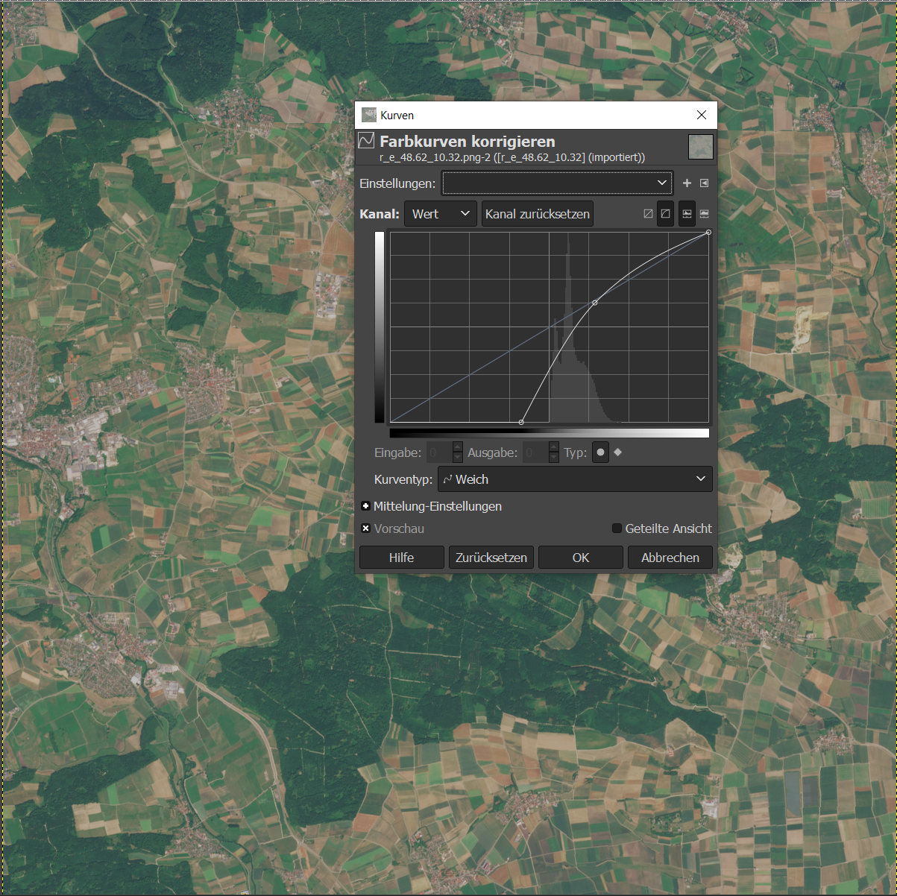

# sentinel tiff --> true color
Converting raw Sentinel-2 13 band images to true color rgb png files.

## get desired colors (using gimp)

- open one of your uncorrected rgb images in [Gimp](https://www.gimp.org/)
- color correct the image with colors --> curves

- save the configuration
- copy the "point" values into a numpy array as the *curve_points_x_y* variable.

